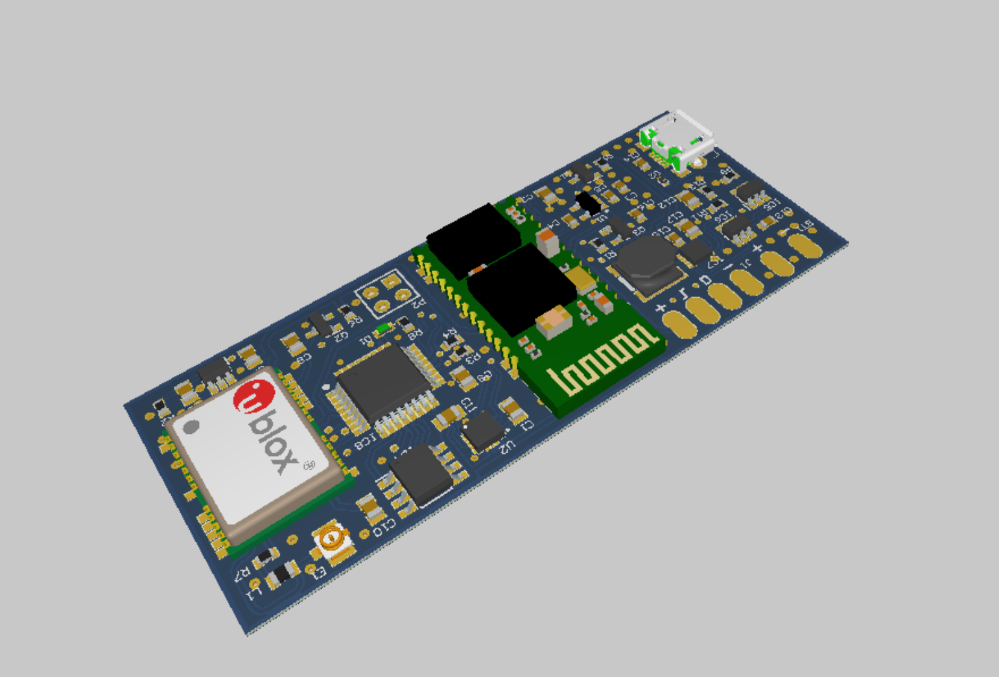

## About

Target of my bachelor thesis was to build my own pulse sensor in a form of band in order to better understand:
* How does pulse meter work
* How battery powered embedded systems are designed
* How to connect multiple peripheral devices and how to control them
* How GUI can be shown on a display
* How to store data when power goes down
* How real-time operating systems (specifically FreeRTOS) work in practice
* And many more...

Project consists of two parts, hardware and software. This repository contains only the hardware part. It represents a single, double-sided PCB, where most of the components are on the top side, and the only component on the bottom side is a pulse sensor.

## Tests and errors

The PCB was build and tested. There are two major problems detected with the PCB:
1. SDA and SLC of the I2C interface are swapped in some places
2. Reset pin of the programming connector requires pull-up

Both errors are fixable, and were corrected on the prototype, but not in the project files.

## How to see the project

You can use desktop Altium Designer (requires license), or [Altium online viewer](https://www.altium.com/viewer/).
